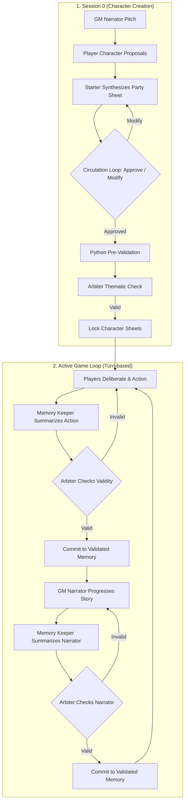

# AutoQuest – LLM Multi-Agent RAG Pipeline

> An autonomous multi-agent RPG simulation framework featuring collaborative character creation (Session 0), a synchronized Game Master validation loop (Narrator, Memory Keeper, and Arbiter), and a real-time event monitoring web dashboard.

AutoQuest is a complete multi-agent roleplaying simulation system that orchestrates coordinated LLM interactions to manage state, private memories, rules, and narrative consistency. The framework demonstrates Retrieval-Augmented Generation (RAG) with shared memory validation and private character thoughts to prevent LLM hallucinations.  
**This project was developed as part of a university course assignment (Agents and Multi-Agent Systems, IST 2025/2026).**

## Contents

- [Overview](#overview)  
- [Features](#features)  
- [Architecture](#architecture)  
- [Technology Stack](#technology-stack)  
- [Project Structure](#project-structure)  
- [Installation](#installation)  
- [How to Run](#how-to-run)  
- [License & Acknowledgments](#license--acknowledgments)

---

## Overview

This project implements a synchronized multi-agent system that simulates a collaborative tabletop RPG session. The system coordinates several independent AI agents to maintain a coherent narrative while enforcing rule and game-state consistency.

The simulation runs through two main phases:

- **Session 0 (Character Creation):** A collaborative negotiation where AI players propose character sheets (Name, Race, Class, Attributes, Personality) using the D&D Standard Array, debate adjustments, and compile a final sheet that is programmatically and semantically validated.
- **Active Campaign:** A turn-based game loop where players deliberate group actions, a Memory Keeper captures and registers events in a shared RAG memory, an Arbiter checks the actions for rule-breaking or hallucinations, and a Narrator continues the story.

The project features a standalone Windows executable (`AutoQuest.exe`) for instant testing, a terminal CLI interface, and a web application featuring a Socket.IO real-time monitor.

---

## Features

### Session 0 Character Creation

- **Collaborative Negotiation:** Multi-round player deliberation where characters vote to approve or modify character proposals.
- **D&D Standard Array Distribution:** Programmatic enforcement of attribute points (15, 14, 13, 12, 10, 8) across standard stats (Str, Dex, Con, Int, Wis, Cha).
- **Dual-Stage Validation:** Fast programmatic pre-validation via Python regex (0 tokens cost) followed by semantic validation via the LLM Arbiter.
- **Character Sheet Locking:** Once approved, sheets are locked in a protected memory block that resists memory condensation.

### Multi-Agent Game Master (GM)

- **Narrator:** Dynamically advances the campaign based on the validated history.
- **Memory Keeper:** Summarizes raw turn details into clean, factual memory entries.
- **Arbiter:** Reviews new memory candidates and deletes or flags them if they contain environmental or item-possession hallucinations.

### Retrieval-Augmented Generation (RAG) & Memory

- **Shared Memory Store (`memory.json`):** Persistent JSON memory with a protected section for player data and an active game history.
- **Memory Condensation:** Automatically condenses older validated memories into high-level summaries when size limits are reached, maintaining a sliding context window.
- **Private Memory Diaries (`memory_diary_{Name}.json`):** Keeps secret thoughts and traits (mood, trust in party, goals) using a space-efficient O(1) format.

---

## Architecture



---

## Technology Stack

### Core and Frameworks

| Component | Technology |
|-----------|------------|
| Language | Python 3.10+ |
| LLM Host | Ollama (local execution) |
| Web Server | Flask 3.1.1 |
| Real-time Communication | Flask-SocketIO 5.5.1 |
| Packaging / Executable | PyInstaller |

### Web Interface Frontend

| Component | Technology |
|-----------|------------|
| Structure & Logic | HTML5, Vanilla JavaScript |
| Styling | Vanilla CSS (Dark Medieval style) |
| Typography | Google Fonts (Cinzel, Crimson Text, JetBrains Mono) |
| Server-Client Sync | Socket.IO client library |

---

## Project Structure

```
AutoQuest/
├── agents/                 # Agent logic and prompts
│   ├── gm/                 # Game Master specialized agents
│   │   ├── arbiter.py      # Rule validation and anti-hallucination
│   │   ├── gm.py           # GM Orchestrator & synchronous campaign runner
│   │   ├── memory_keeper.py# Event facts summarizer
│   │   ├── memory_store.py # Read/Write interface for memory.json
│   │   └── narrator.py     # Story narration generator
│   ├── player.py           # Player agent action, synthesis, and review
│   └── session_zero.py     # Character creation & voting protocol
├── models/                 # Shared data structures (Player, Class, Item)
├── web/                    # Flask + Socket.IO Server and Frontend
│   ├── templates/          # HTML Templates (index.html with custom styling)
│   └── server.py           # Socket.IO Event listener and Web interface hook
├── tests/                  # Unit and integration tests
│   ├── test.py             # Basic model tests
│   ├── test_diary_segregation.py  # Diary isolation tests
│   └── test_memory_management.py # Memory validation and condensation tests
├── AutoQuest.exe           # Standalone pre-compiled Windows executable
├── config.py               # Ollama model wrappers, Token tracking, and Loggers
├── main.py                 # CLI Game entrypoint
├── requirements.txt        # Project package dependencies
└── README.md
```

---

## Installation

### Prerequisites

| Requirement | Version |
|-------------|---------|
| Operating System | Windows (for Executable), Any (for Python source) |
| Python | 3.10 or higher |
| Ollama | Latest (running locally) |

### Setup Steps

1. **Clone the repository**
   ```bash
   git clone https://github.com/LuisAPR1/AutoQuest-LLM-Multi-Agent-RAG-Pipeline.git
   cd AutoQuest-LLM-Multi-Agent-RAG-Pipeline
   ```

2. **Pull the configured LLM**
   By default, the project configures `gpt-oss:20b-cloud` (or you can update `MODEL` in `config.py` to any model such as `llama3` or `mistral`):
   ```bash
   ollama pull llama3
   ```

3. **Install python dependencies (if running from source)**
   ```bash
   python -m venv .venv
   # On Windows:
   .venv\Scripts\activate
   # On macOS/Linux:
   source .venv/bin/activate

   pip install -r requirements.txt
   ```

---

## How to Run

### Option A: Standalone Executable (Windows Only)

You can run the application instantly using the pre-compiled executable at the root of the project:

1. Double-click `AutoQuest.exe` or run it from the terminal:
   ```cmd
   AutoQuest.exe
   ```

### Option B: Interactive CLI Mode (from Source)

Play or simulate the game directly inside your terminal:
```bash
python main.py
```

### Option C: Web GUI Mode (from Source)

Launch the Flask server to view the simulation in the dynamic medieval-themed dashboard:
```bash
python web/server.py
```
Open your browser and navigate to:
**[http://127.0.0.1:5050](http://127.0.0.1:5050)**

---

## License & Acknowledgments

- Educational project developed as part of the Agents and Multi-Agent Systems course (IST, 2025/2026).  
- Built on top of Flask, Flask-SocketIO, Ollama, and PyInstaller.  
- Source code is licensed under the MIT License — see [LICENSE](LICENSE).  

---

*README written with supervised assistance from Gemini 3.5.*
