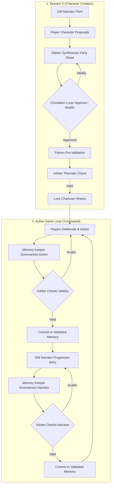

# AutoQuest

[](https://www.python.org/downloads/)
[](https://ollama.com)
[](https://flask.palletsprojects.com/)
[](https://opensource.org/licenses/MIT)

An **AI-Powered Multi-Agent RPG Campaign Simulator** that brings cooperative tabletop roleplaying to life. Multiple AI players and a specialized multi-agent AI Game Master interact to create characters, coordinate actions, validate rules, and play through an epic, coherent story.

With support for both an **interactive terminal CLI** and a **dynamic WebSocket-powered Web GUI**, AutoQuest demonstrates how a pipeline of coordinated LLMs can handle state, memory, rules, and narrative consistency.

---

## Table of Contents
1. [Core Features](#core-features)
2. [Architecture Overview](#architecture-overview)
3. [System Mechanics](#system-mechanics)
4. [Getting Started](#getting-started)
5. [How to Run](#how-to-run)
6. [Project Structure](#project-structure)
7. [Configuration](#configuration)

---

## Core Features

### 1. Specialized Multi-Agent Game Master (GM)
Instead of relying on a single, expensive LLM prompt to run the game, the Game Master is split into three specialized agents for optimal reliability, speed, and narrative consistency:
*   **Narrator**: Progresses the story and describes the outcomes of validated actions in 3–6 sentences.
*   **Memory Keeper**: Captures the raw logs of player actions and events, summarizing them into concise, factual statements.
*   **Arbiter (Anti-Hallucination Guard)**: The referee. It compares new actions against validated facts. If a player or narrator "hallucinates" (e.g., uses an item they don't possess or changes the environment invalidly), the Arbiter rejects the action, triggers a retry loop, or deletes the offending memory.

### 2. Session 0: Character Creation Protocol
Before the campaign begins, the AI players and GM undergo a collaborative **Session 0**:
1.  **World Pitch**: The GM Narrator introduces the setting and theme.
2.  **Character Proposals**: Players draft their Name, Race, Class, Personality, and distribute the **D&D Standard Array** attributes.
3.  **Deliberation & Synthesis**: A random starter compiles the proposals, followed by a circulation pass where players vote to `APPROVE` or `MODIFY` the sheet.
4.  **Dual-Stage Validation**: 
    *   **Python Pre-validation**: Programmatically verifies that all characters have exactly the 6 Standard Array attributes and 100 HP (saving LLM token costs).
    *   **LLM Arbiter Verification**: Checks thematic consistency and world compliance.
5.  **Character Sheet Locking**: Once approved, character sheets are written to a protected block in memory and to the players' private diaries.

### 3. State Management & Memory Diaries
*   **Shared Memory (`memory.json`)**: Tracks the validated history of the campaign. Character data is stored in a `protected_player_data` block, preventing it from being modified or truncated during memory condensation/compression.
*   **Private Memory Diaries (`memory_diary_{Name}.json`)**: Each player maintains their own thoughts and evolving traits (mood, trust in party, risk tolerance, goals) updated via a memory-efficient $O(1)$ trait tracking structure.

---

## Architecture Overview



---

## System Mechanics

### D&D Standard Array
During Session 0, players must distribute the six standard attribute scores: **15, 14, 13, 12, 10, 8** across their D&D stats:
*   **Strength (Str)** | **Dexterity (Dex)** | **Constitution (Con)**
*   **Intelligence (Int)** | **Wisdom (Wis)** | **Charisma (Cha)**

### Shared Memory Formatting
Memory entries are serialized with validation tags and author tags to keep the LLM context structured:
```
[SYSTEM_PROTECTED_PLAYER_DATA]
Player_1: {Name: Thorin, Race: Dwarf, Class: Cleric, Attributes: [Str:15, Dex:8, Con:14, Int:10, Wis:13, Cha:12], HP: 100...}
[/SYSTEM_PROTECTED_PLAYER_DATA]

--- GAME HISTORY ---
[validated] [narrator] (id=f8167405): The party arrives at the ruined marketplace.
[validated] [Thorin] (id=532f382e): Thorin swings a merchant hammer at the Lurker demon.
```

---

## Getting Started

### Prerequisites
*   **Python 3.10 or higher**
*   **Ollama** (running locally)

### 1. Install & Run Ollama
Download Ollama from [ollama.com](https://ollama.com) and start the service.

Ensure you have the model pulled that is configured in `config.py`. By default, the project is configured to use `gpt-oss:20b-cloud`, but you can pull any model you prefer (e.g., `llama3` or `mistral`) and update the `MODEL` configuration in [config.py](file:///c:/Users/Luisr/Desktop/IST/ASSMA/AutoQuest/config.py):
```bash
ollama pull llama3
```

### 2. Setup the Python Virtual Environment
Clone the repository and navigate to the project directory:
```bash
# Create virtual environment
python -m venv .venv

# Activate virtual environment
# On Windows:
.venv\Scripts\activate
# On macOS/Linux:
source .venv/bin/activate

# Install dependencies
pip install -r requirements.txt
```

---

## How to Run

### Option A: Interactive CLI Mode
Play or simulate the game directly inside your terminal. You can specify the number of players (1 to 6).
```bash
python main.py
```

### Option B: Dynamic Web GUI Mode
Run the Flask server to view the simulation in a stunning, real-time web dashboard featuring dark medieval styling, animated HP bars, active GM pipeline feeds, and phase logs.
```bash
# Start the Web Server
python web/server.py
```
After starting the server, open your browser and navigate to:
**[http://127.0.0.1:5050](http://127.0.0.1:5050)**

Choose the number of players and click **Start Campaign** to watch the agents plan, deliberate, and roll actions in real time!

---

## Project Structure

```
AutoQuest/
│
├── agents/                 # Agent logic and prompts
│   ├── gm/                 # Game Master specialized agents
│   │   ├── arbiter.py      # Rule validation and anti-hallucination
│   │   ├── gm.py           # GM Orquestrator & synchronous campaign runner
│   │   ├── memory_keeper.py# Event facts summarizer
│   │   ├── memory_store.py # Read/Write interface for memory.json
│   │   └── narrator.py     # Story narration generator
│   ├── player.py           # Player agent action, synthesis, and review
│   └── session_zero.py     # Character creation & voting protocol
│
├── models/                 # Shared data structures (Player, Class, Item)
├── web/                    # Flask + Socket.IO Server and Frontend
│   ├── templates/          # HTML Templates (index.html with custom styling)
│   └── server.py           # Socket.IO Event listener and Web interface hook
│
├── config.py               # Ollama model wrappers, Token tracking, and Loggers
├── main.py                 # CLI Game entrypoint
├── requirements.txt        # Project package dependencies
└── tests/                  # Unit and integration tests
```

---

## Configuration

Key simulation parameters can be configured directly in the code:
*   **Ollama Model**: E.g., `MODEL = "llama3"` in [config.py](file:///c:/Users/Luisr/Desktop/IST/ASSMA/AutoQuest/config.py).
*   **Campaign Turns**: Configure `NUM_ROUNDS = 20` in [main.py](file:///c:/Users/Luisr/Desktop/IST/ASSMA/AutoQuest/main.py) or [server.py](file:///c:/Users/Luisr/Desktop/IST/ASSMA/AutoQuest/web/server.py).
*   **Session 0 Limit**: Set `SESSION_ZERO_MAX_ROUNDS = 3` in [session_zero.py](file:///c:/Users/Luisr/Desktop/IST/ASSMA/AutoQuest/agents/session_zero.py).
*   **Max Modifications**: Set `MAX_MODIFICATIONS = 3` in [session_zero.py](file:///c:/Users/Luisr/Desktop/IST/ASSMA/AutoQuest/agents/session_zero.py).

---

*Enjoy your automated RPG journey! May the rolls be in your favor.*
